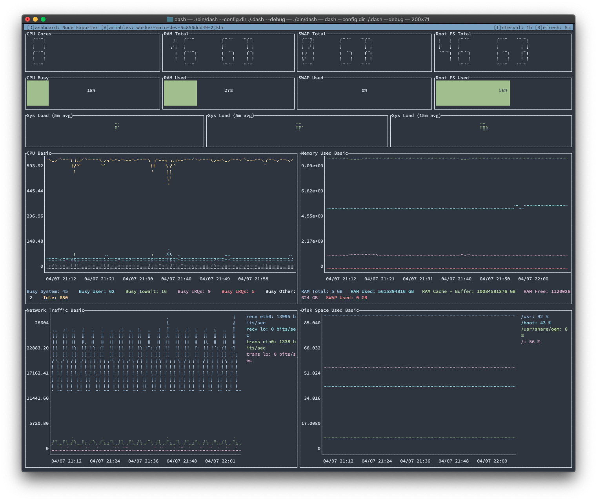

# dash

**dash** is a terminal dashboard solution inspired by [Grafana](https://grafana.com), to visualize and explore your data.



## Features

- **Multiple Datasources:** Multiple datasources can be defined via yaml files.
- **Multiple Dashboards:** Dashboards can be defined via yaml files and can be switch during runtime.
- **Time Interval:** Query the data for different time intervals.
- **Refresh Rate:** Refresh your data every x seconds.
- **Multiple Graphs:** Choose between multiple graph types to visualize your data.
- **Dynamic Datasources:** Use multiple datasources for one dashboard.
- **Explore Mode:** Run ad hoc queries to explore your data.

> **Note:** If you want to contribute (adding a missing or new feature) feel free to create a PR. If you want to share a dashboard please add the `.yaml` file and a screenshot to the [examples folder](https://github.com/ricoberger/dash/tree/master/examples).

## Getting Started

The dash binaries are available at the [releases](https://github.com/ricoberger/dash/releases) page for macOS, Linux and Windows. You can download the binary for your operating system and directly run it. You can also follow below steps to download dash and place it in your `PATH`.

```sh
VERSION=1.0.0
GOOS=$(go env GOOS)
GOARCH=$(go env GOARCH)
wget https://github.com/ricoberger/dash/releases/download/$VERSION/dash-$GOOS-$GOARCH
sudo install -m 755 dash-$GOOS-$GOARCH /usr/local/bin/dashboard
```

The complete **[Getting Started](https://github.com/ricoberger/dash/wiki/Getting-Started)** guide can be found in the **[wiki](https://github.com/ricoberger/dash/wiki)**.
